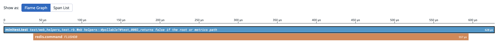

# Datadog CI Visibility for Ruby

[](https://badge.fury.io/rb/datadog-ci)
[](https://datadoghq.dev/datadog-ci-rb/)
[](https://app.codecov.io/gh/DataDog/datadog-ci-rb/branch/main)
[](https://dl.circleci.com/status-badge/redirect/gh/DataDog/datadog-ci-rb/tree/main)

Datadog's Ruby Library for instrumenting your test and continuous integration pipeline.
Learn more on our [official website](https://docs.datadoghq.com/tests/) and check out our [documentation for this library](https://docs.datadoghq.com/tests/setup/ruby/?tab=cloudciprovideragentless).

## Installation

Add to your Gemfile.

```ruby
group :test do
  gem "datadog-ci"
end
```

## Upgrade from ddtrace v1.x

If you used test visibility for Ruby with ddtrace gem, check out our [upgrade guide](/docs/UpgradeGuide.md).

## Usage

### RSpec

To activate `RSpec` integration, add this to the `spec_helper.rb` file:

```ruby
require 'rspec'
require 'datadog/ci'

# Only activates test instrumentation on CI
if ENV["DD_ENV"] == "ci"
  Datadog.configure do |c|
    # The name of the service or library under test
    c.service = 'my-ruby-app'
    c.ci.enabled = true
    c.ci.instrument :rspec
  end
end
```

### Minitest

The Minitest integration will trace all executions of tests when using `minitest` test framework.

To activate your integration, use the `Datadog.configure` method:

```ruby
require 'minitest'
require 'datadog/ci'

# Only activates test instrumentation on CI
if ENV["DD_ENV"] == "ci"
# Configure default Minitest integration
  Datadog.configure do |c|
    # The name of the service or library under test
    c.service = 'my-ruby-app'
    c.ci.enabled = true
    c.ci.instrument :minitest
  end
end
```

> [!IMPORTANT]
> When using `minitest/autorun` the order of requires matters: `datadog/ci` must be
> always required before `minitest/autorun`.

Example using `minitest/autorun`

```ruby
require 'datadog/ci'
require 'minitest/autorun'

if ENV["DD_ENV"] == "ci"
  Datadog.configure do |c|
    c.service = 'my-ruby-app'
    c.ci.enabled = true
    c.ci.instrument :minitest
  end
end
```

### Cucumber

Activate `Cucumber` integration with configuration

```ruby
require 'cucumber'
require 'datadog/ci'

# Only activates test instrumentation on CI
if ENV["DD_ENV"] == "ci"
  Datadog.configure do |c|
    # The name of the service or library under test
    c.service = 'my-ruby-app'
    c.ci.enabled = true
    c.ci.instrument :cucumber
  end
end
```

### Instrumentation options

Configuration `ci.instrument` accepts the following optional parameters:

- `enabled` (default: `true`) - defines whether tests should be traced (useful for temporarily disabling tracing)
- `service_name` - service name used for this instrumentation (when you want it to be different for given test framework)

Example usage:

```ruby
  Datadog.configure do |c|
    c.service = 'my-ruby-app'
    c.ci.enabled = true
    c.ci.instrument :cucumber, service_name: 'my-cucumber-features', enabled: true
    c.ci.instrument :minitest, service_name: 'my-unit-tests', enabled: false
  end
```

## Agentless mode

If you are using a cloud CI provider without access to the underlying worker nodes, such as GitHub Actions or CircleCI, configure the library to use the Agentless mode. For this, set the following environment variables:
`DD_CIVISIBILITY_AGENTLESS_ENABLED=true (Required)` and `DD_API_KEY=your_secret_api_key (Required)`.

Additionally, configure which [Datadog site](https://docs.datadoghq.com/getting_started/site/) you want to send data to:
`DD_SITE=your.datadoghq.com` (datadoghq.com by default).

Agentless mode can also be enabled via `Datadog.configure` (but don't forget to set DD_API_KEY environment variable):

```ruby
Datadog.configure { |c| c.ci.agentless_mode_enabled = true }
```

## Additional configuration

### Add tracing instrumentations

It can be useful to have rich tracing information about your tests that includes time spent performing database operations
or other external calls like here:



To achieve this, add Datadog tracing instrumentations in your `Datadog.configure` block:

```ruby
Datadog.configure do |c|
  #  ... ci configs and instrumentation here ...
  c.tracing.instrument :redis
  c.tracing.instrument :pg
end
```

...or enable auto instrumentation in your test_helper/spec_helper:

```ruby
require "datadog/auto_instrument"
```

Note: in CI mode these traces are going to be submitted to CI Visibility,
they will **not** show up in Datadog APM.

For the full list of available instrumentations see [datadog documentation](https://github.com/DataDog/dd-trace-rb/blob/master/docs/GettingStarted.md)

### WebMock

[WebMock](https://github.com/bblimke/webmock)
is a popular Ruby library that stubs HTTP requests when running tests.
By default it fails when used together with datadog-ci as traces are being sent
to Datadog via HTTP calls.

In order to allow HTTP connections for Datadog backend you would need to configure
Webmock accordingly.

```ruby
# when using agentless mode
WebMock.disable_net_connect!(:allow => /datadoghq/)

# when using agent
WebMock.disable_net_connect!(:allow_localhost => true)

# or for more granular setting set your agent URL
WebMock.disable_net_connect!(:allow => "localhost:8126")
```

### VCR

[VCR](https://github.com/vcr/vcr) is another popular testing library for HTTP interactions.

It requires additional configuration to correctly work with datadog-ci:

```ruby
VCR.configure do |config|
  # ... your usual configuration here ...

  # when using agent
  config.ignore_hosts "127.0.0.1", "localhost"

  # when using agentless mode
  # note to use the correct datadog site (e.g. datadoghq.eu, etc)
  config.ignore_hosts "citestcycle-intake.datadoghq.com", "api.datadoghq.com", "citestcov-intake.datadoghq.com"
end
```

### Disabling startup logs

Startup logs produce a report of tracing state when the application is initially configured.
These logs are activated by default in test mode, if you don't want them you can disable this
via `DD_TRACE_STARTUP_LOGS=0` or in the configure block:

```ruby
Datadog.configure { |c| c.diagnostics.startup_logs.enabled = false }
```

### Enabling debug mode

Switching the library into debug mode will produce verbose, detailed logs about tracing activity, including any suppressed errors. This output can be helpful in identifying errors, confirming trace output, or catching HTTP transport issues.

You can enable this via `DD_TRACE_DEBUG=1` or in the configure block:

```ruby
Datadog.configure { |c| c.diagnostics.debug = true }
```

## Contributing

See [development guide](/docs/DevelopmentGuide.md), [static typing guide](docs/StaticTypingGuide.md) and [contributing guidelines](/CONTRIBUTING.md).

## Code of Conduct

Everyone interacting in the `Datadog::CI` project's codebases, issue trackers, chat rooms and mailing lists is expected to follow the [code of conduct](/CODE_OF_CONDUCT.md).
